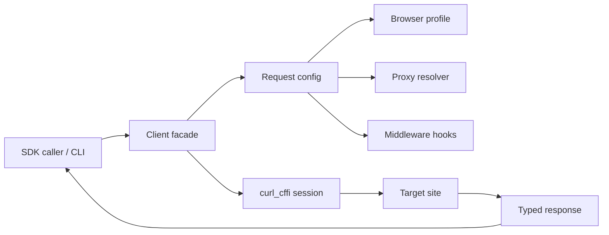

# curlx - Public Technical Brief

Repository visibility: private

This is a public-safe technical brief for `curlx`. It explains the product
positioning, runtime model, and engineering decisions without publishing private
source code.

## One-Line Positioning

`curlx` is a browser-grade Python HTTP SDK and CLI for crawling infrastructure:
it wraps `curl_cffi` with TLS impersonation, typed responses, proxy rotation,
bounded async concurrency, retry policy, circuit breaking, and terminal tooling.

## Product Problem

Modern crawling workloads often fail below application logic. Targets evaluate
TLS handshakes, JA3-like fingerprints, HTTP behavior, header shape, proxy
reputation, retry cadence, and concurrency patterns before the scraper ever
parses HTML.

Most HTTP wrappers solve only request ergonomics. `curlx` is positioned as the
transport layer between simple scripts and larger data platforms:

- use real browser impersonation profiles through `curl_cffi`;
- keep sync, async, and CLI workflows aligned;
- centralize proxy rotation and request policy;
- bound concurrency explicitly for worker stability;
- expose retries, circuit breaking, middleware, and typed response helpers.

## Architecture Diagram

## Data And Control Flow

1. The caller chooses sync client, async client, or CLI mode.
2. Request configuration is normalized: method, URL, timeout, headers, body,
   browser profile, proxy policy, and concurrency limit.
3. The proxy resolver selects a proxy using the configured strategy.
4. Middleware hooks can inspect or mutate request and response envelopes.
5. `curl_cffi` sends the request using the selected browser impersonation
   target.
6. The response is wrapped in a small typed facade for status, headers, cookies,
   text, JSON, and raw transport access.
7. Retry and circuit-breaker behavior converts transient failures into bounded,
   observable control flow instead of unbounded worker churn.

## Stack

- Python 3.9+
- `curl_cffi` for browser-grade TLS impersonation
- `asyncio` for bounded high-concurrency request execution
- Typer CLI and Rich-style terminal output
- Pydantic-style request and configuration models
- pytest, pytest-asyncio, ruff, mypy, and coverage tooling

## Security And Reliability Notes

- The SDK does not hand-roll TLS or JA3 internals; it delegates browser
  transport behavior to `curl_cffi` and owns the operational workflow around it.
- Async execution is guarded by semaphores so one batch cannot consume an entire
  worker process.
- Retry and circuit-breaker policy are explicit, making proxy failures and
  target-side throttling easier to isolate.
- Proxy rotation supports deterministic, random, weighted, and sticky-session
  patterns so IP reputation and cookie continuity can be managed together.
- `curlx` is not a legal-policy engine, queue system, browser automation layer,
  or distributed scheduler. Those remain responsibilities of the caller.

## Current State

The private repository contains the core package shape:

- sync and async HTTP clients;
- request and response models;
- browser impersonation profile mapping;
- proxy model and rotation strategies;
- retry and circuit-breaker primitives;
- middleware hooks;
- CLI commands for reproducible transport probes;
- focused tests around client behavior, CLI behavior, proxy rotation, and retry
  behavior.

## Roadmap

- Domain-level request policy profiles.
- Proxy health scoring and quarantine windows.
- Metrics hooks for larger crawler workers.
- More explicit middleware recipes.
- Optional control-plane surface for inspecting profiles, proxy pools, and
  request policy outside the CLI.

## Portfolio Relevance

`curlx` demonstrates the lower-level engineering behind production crawling:
transport impersonation, async concurrency control, proxy/session design,
failure isolation, typed Python package structure, and developer-facing CLI
ergonomics.
