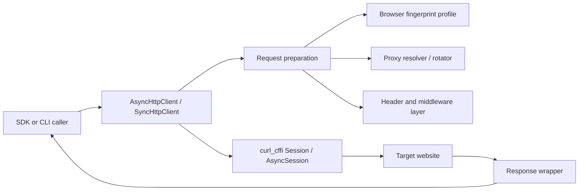

# curlx - Public Technical Brief

Repository visibility: private

This document is a public-safe architecture note for `curlx`. It explains the
product, runtime model, and engineering decisions without publishing the source
code of the private repository.

## One Line

`curlx` is a Python HTTP SDK and CLI built on top of `curl_cffi` for production
crawling workloads that need browser-grade TLS impersonation, proxy rotation,
typed responses, retry policy, and terminal ergonomics in one package.

## Problem

Many crawler stacks fail before application-layer logic runs because modern bot
defenses fingerprint the TLS handshake, HTTP/2 behavior, header shape, proxy
identity, retry cadence, and request concurrency. A basic `requests` or `curl`
wrapper can send HTTP, but it usually cannot mimic real browser transport
behavior or provide crawler-grade operational controls.

`curlx` is designed around that gap:

- Impersonate real browser TLS profiles through `curl_cffi`.
- Keep sync and async APIs aligned.
- Support high-concurrency async crawling with explicit limits.
- Rotate proxies with deterministic or weighted strategy.
- Provide retry, circuit breaker, middleware, and typed response utilities.
- Expose the same engine through a `Typer` CLI with `Rich` output.

## High Level Architecture

The package keeps transport concerns and crawler operations separate:

- `client.py`: public async/sync clients and request methods.
- `session.py`: `curl_cffi` session creation with profile, proxy, timeout, and headers.
- `fingerprint.py`: named browser impersonation profiles.
- `proxy.py`: proxy model and rotation strategies.
- `retry.py`: retry decorator and circuit breaker.
- `middleware.py`: request/response hooks.
- `models.py`: request config and response wrapper.
- `cli.py`, `cli_output.py`: terminal interface and formatted output.

## Runtime Flow

1. The caller chooses sync or async mode.
2. Client configuration is normalized:
   - browser profile,
   - timeout,
   - TLS verification flag,
   - default headers,
   - proxy configuration,
   - concurrency limit.
3. The client creates a `curl_cffi` session through `SessionFactory`.
4. Each request merges default and per-request headers.
5. Async requests pass through a semaphore so concurrency is bounded.
6. `curl_cffi` sends the request using the chosen browser impersonation target.
7. The raw response is wrapped in a small typed `Response` facade.
8. Consumers can inspect status, body, cookies, headers, and raw transport response.

## Public API Model

### Async client

The async client is optimized for high-volume crawling:

- Uses an `asyncio.Semaphore` to enforce `max_concurrent`.
- Uses a single `AsyncSession` per context manager lifecycle.
- Provides method helpers for `GET`, `POST`, `PUT`, `PATCH`, `DELETE`, and `HEAD`.
- Supports batch execution through `fetch_all`.

### Sync client

The sync client keeps the same shape for scripts and CLI-like workloads:

- Uses a standard `curl_cffi.Session`.
- Uses the same request preparation logic as async.
- Exposes equivalent method helpers.

### Response wrapper

`Response` is intentionally thin. It keeps the underlying `curl_cffi` response
available while adding ergonomic helpers:

- `status_code`, `url`, `headers`, `cookies`, `content`, `text`.
- `json()` for JSON decoding.
- `raise_for_status()` for status-based errors.
- status family helpers such as success, redirect, client error, server error.

## Browser Fingerprinting

`curlx` models browser impersonation as named profiles. A profile maps a
human-readable browser target to the `curl_cffi` impersonation string.

Supported families include:

- Chrome desktop and Android profiles.
- Safari desktop and iOS profiles.
- Firefox profiles.
- Edge profiles.
- Tor-oriented profile names.

The important design choice is that the rest of the SDK does not hand-roll JA3
or TLS settings. It delegates browser transport behavior to `curl_cffi`, while
`curlx` owns the surrounding crawler workflow.

## Proxy Rotation

Proxy handling is normalized into a `Proxy` object and a `ProxyRotator`.

Supported rotation strategies:

- `round_robin`: deterministic cycling through the pool.
- `random`: random selection per request.
- `weighted_random`: weighted probability per proxy.
- sticky sessions: map a session key to the same proxy for continuity.

This is important for crawling sessions where cookies, IP reputation, and target
rate limits must be managed together.

## Retry and Circuit Breaker

The retry layer supports both sync and async call sites.

Default retryable status codes include common transient failures:

- timeout or conflict-like status codes,
- throttling,
- server and gateway failures.

The circuit breaker has three states:

- `CLOSED`: traffic flows normally.
- `OPEN`: calls fail fast after repeated failures.
- `HALF_OPEN`: after recovery timeout, limited probe calls are allowed.

This prevents a failing target, bad proxy segment, or upstream block from
consuming the entire crawler worker pool.

## CLI Layer

The CLI turns the same SDK into a terminal HTTP client:

- method commands for common HTTP verbs,
- proxy and impersonation flags,
- JSON/body/header input,
- output-to-file,
- pretty JSON,
- verbose mode,
- browser profile listing,
- user-agent sampling.

The CLI exists to make debugging crawler behavior reproducible without writing a
Python script for every probe.

## Operational Boundaries

`curlx` is an HTTP client layer, not a full crawler platform. It deliberately
does not own:

- distributed scheduling,
- persistent queueing,
- browser automation,
- HTML parsing,
- account/session storage beyond the active request session,
- legal or terms-of-service policy enforcement.

Those belong in the application using the SDK.

## Testing Surface

The private repo contains focused tests around:

- client behavior,
- CLI behavior,
- proxy rotation,
- retry behavior.

The test setup targets Python 3.9+ and uses `pytest`, `pytest-asyncio`, coverage,
`ruff`, and `mypy`.

## Roadmap Ideas

- Per-domain policy profiles.
- Proxy health scoring and quarantine windows.
- First-class metrics hooks.
- Pluggable user-agent/header bundles.
- More explicit middleware examples.
- Structured crawl result envelope for larger pipelines.

## Portfolio Relevance

This project demonstrates practical backend and data-infrastructure work:

- transport-level browser impersonation,
- async concurrency control,
- crawler reliability primitives,
- proxy/session design,
- CLI ergonomics,
- typed Python package structure.
