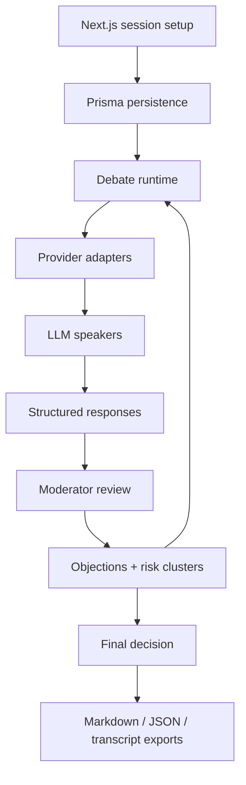

# high-council - Public Technical Brief

Repository visibility: public

This document is a portfolio-oriented architecture note for `high-council`. The
source repository is public, but this brief summarizes the system for readers
who want the product and engineering shape before reading the full codebase.

## One-Line Positioning

`high-council` is a Next.js and Prisma multi-LLM decision platform where an
active moderator directs role-based agents through structured critique,
objection tracking, risk clustering, and auditable final decisions.

## Product Problem

A single LLM response often hides weak assumptions. A naive multi-agent setup
often becomes passive voting. `high-council` treats decision quality as a
managed process:

- agents critique a thesis from different roles;
- the moderator targets the most decision-relevant unresolved claim;
- objections are tracked as decision debt;
- repeated risks are clustered into decision themes;
- final output is structured, exportable, and traceable.

## Architecture Diagram

## Data And Control Flow

1. A user creates a session with thesis, context, success criteria, chair model,
   speaker models, language, and decision mode.
2. Prisma stores the session, agents, turns, responses, objections, risk
   clusters, final decision, and telemetry.
3. The debate runtime assigns the current phase: framing, role critique,
   cross-examination, revised proposal, or execution plan.
4. Speaker agents return structured JSON: stance, argument, risk, challenged
   assumption, next focus, objection links, evidence, and confidence.
5. The moderator reviews the state, chooses the next target claim, updates
   objections, clusters risks, and decides whether to continue or converge.
6. The finalizer converts the audit trail into a structured decision, open
   risks, milestones, acceptance criteria, and next actions.

## Stack

- Next.js app router
- TypeScript
- React UI components
- Prisma
- PostgreSQL
- Multi-provider LLM adapters: OpenAI-compatible APIs, Anthropic, Gemini,
  OpenRouter, Ollama, and LM Studio
- Structured JSON validation and retry/repair handling
- Token, latency, abstain, retry, and provider-error telemetry

## Security And Reliability Notes

- Provider calls are isolated behind adapters so model routing and failure
  handling are not coupled to the debate runtime.
- Structured output is validated before it mutates session state.
- Invalid model output can trigger stricter retry behavior; repeated failures
  become abstains and telemetry events instead of corrupting the session.
- Objection IDs, agent IDs, and turn IDs make debate history traceable.
- Local model providers such as Ollama and LM Studio are supported for private
  or offline experimentation where appropriate.

## Current State

The public repository includes:

- Next.js application structure;
- Prisma schema for sessions, agents, turns, responses, moderator events,
  objections, risk clusters, final decisions, and telemetry;
- debate runtime and phase logic;
- provider abstraction layer;
- moderator and speaker prompt contracts;
- structured schemas for validated model output;
- API routes and UI surfaces for session setup and debate flow.

## Roadmap

- Improve evidence attachment and source-aware decisions.
- Add richer export formats for decision records.
- Add comparison views across model/provider runs.
- Add stronger cost controls for long sessions.
- Expand local-model workflows for private engineering review.

## Portfolio Relevance

`high-council` demonstrates TypeScript product engineering, Next.js application
architecture, Prisma-backed domain modeling, multi-provider LLM orchestration,
structured-output validation, and AI tooling that produces auditable decisions
instead of one-off chat responses.
