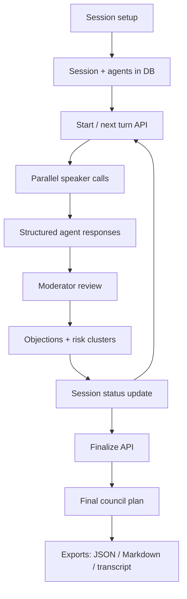

# high-council - Public Technical Brief

Repository visibility: public

This document is a deeper architecture note for `high-council`. The source
repository is public, but this brief is written for portfolio visitors who want
to understand the technical system without reading the entire codebase.

## One Line

`high-council` is a Next.js decision intelligence app where multiple LLM agents
debate a thesis under an active moderator, produce structured objections and
risk clusters, and end with an auditable final decision or execution plan.

## Product Thesis

A single LLM answer often hides weak assumptions. A naive multi-agent system
often becomes passive voting. `high-council` instead treats decision quality as
a process:

- roles critique a thesis from different perspectives,
- the moderator targets the most decision-relevant claim,
- unresolved objections are tracked as decision debt,
- risk clusters become explicit gates,
- the final answer is structured, exportable, and traceable.

## Stack

- Next.js app router.
- TypeScript.
- Prisma.
- PostgreSQL.
- Multi-provider LLM abstraction:
  - OpenAI,
  - Anthropic,
  - Google Gemini,
  - OpenRouter,
  - Ollama,
  - LM Studio.
- Structured JSON parsing and repair.
- UI components built around session setup, live debate, and decision
  intelligence panels.

## System Architecture

## Core Domain Model

The Prisma schema models the debate as a durable audit trail.

### Session

Owns:

- title,
- thesis,
- success criteria,
- context,
- chair model,
- speaker models,
- language,
- max turns,
- current round,
- decision mode,
- status,
- related agents, turns, moderator events, objections, risk clusters, final
  decision, and telemetry.

### Agent

Represents one speaker in the council:

- name,
- role,
- provider,
- model,
- system prompt,
- temperature,
- order index.

### DebateTurn

One round of debate:

- round number,
- turn type,
- target claim,
- moderator question,
- consensus state.

### AgentResponse

Structured speaker output:

- stance,
- main argument,
- risk,
- challenged assumption,
- recommended next focus,
- objection or agent reference,
- confidence,
- raw output,
- token and latency metadata.

### ModeratorEvent

Records moderator steering:

- target claim,
- next question,
- reason for next round,
- recommended action,
- consensus state,
- focus objection IDs,
- raw output or provider error.

### Objection

Tracks decision debt:

- source agent,
- target claim,
- objection text,
- owner role,
- resolution criteria,
- severity,
- status,
- resolution link.

### RiskCluster

Groups repeated or related risks into decision themes.

### FinalDecision

Stores the result:

- decision type,
- summary,
- consensus points,
- divergence points,
- unresolved risks,
- next actions,
- generated plan markdown,
- milestones,
- acceptance criteria,
- open questions,
- confidence.

### Telemetry

Tracks:

- total tokens,
- total cost,
- retries,
- abstains,
- provider errors,
- average latency.

## Debate Protocol

The runtime assigns a phase based on the round number:

- `framing`: strongest version, weakest assumption, first blocker.
- `role_critique`: role-specific constraints and validation needs.
- `cross_examination`: answer assigned objections and challenge claims.
- `revised_proposal`: convert debate into a narrowed proposal.
- `execution_plan`: converge into gates and acceptance criteria.

This gives the debate shape instead of repeating the same broad critique in
every turn.

## Active Moderator

The moderator is not a summarizer. It is a control loop.

Each moderator review must:

- identify the most decision-relevant unresolved claim,
- detect weak assumptions and contradictions,
- produce a targeted next question,
- decide whether to continue, converge, split, or stop,
- focus at most three objections,
- avoid duplicate objections,
- mark objections as addressed or accepted as constraints only when justified,
- group risks into useful themes.

The moderator output is validated against a schema before it affects the session.

## Agent Response Contract

Each speaker returns structured JSON:

- `stance`: support, oppose, neutral, conditional, or abstain.
- `main_argument`: concise core argument.
- `risk`: primary risk.
- `assumption_challenged`: weak assumption under scrutiny.
- `recommended_next_focus`: what should be examined next.
- `responds_to_objection_id`: link to decision debt when applicable.
- `responds_to_agent_id`: link to another speaker when applicable.
- `resolution_evidence`: what would resolve the claim.
- `confidence`: numeric confidence.

Invalid structured output triggers a stricter retry. If the retry fails, the
speaker abstains and telemetry records a provider error.

## Provider Layer

Providers implement a common interface:

- list available models,
- complete a prompt,
- health check readiness.

The retry wrapper uses exponential backoff. This keeps the debate runtime
provider-agnostic and allows cloud and local models in the same session.

## Status Model

Session status is explicit:

- draft,
- configured,
- running,
- waiting for provider,
- retrying,
- split detected,
- paused,
- cancelled,
- finalized,
- failed.

This matters because LLM provider failure is a normal operating condition, not a
surprise exception.

## Finalization

Finalization builds a transcript from:

- all debate turns,
- agent responses,
- moderator events,
- objections,
- risk clusters,
- telemetry.

The chair model then produces a final council plan with:

- decision type,
- revised direction summary,
- consensus points,
- divergence points,
- unresolved risk gates,
- 1-2 week next actions,
- milestones,
- acceptance criteria,
- open questions,
- confidence.

If high or critical objections are still open, the system is instructed not to
call the result a clean consensus.

## Export Surface

The app includes routes for:

- session JSON,
- transcript,
- final decision JSON,
- Markdown plan,
- Markdown transcript.

This is what makes the result auditable and reusable outside the UI.

## Why This Design Is Interesting

`high-council` combines product workflow and backend rigor:

- durable debate state,
- structured LLM outputs,
- provider abstraction,
- retry and parse fallback,
- objection ledger,
- risk clustering,
- telemetry,
- final decision constraints.

The core idea is to turn LLM disagreement into a useful engineering artifact
instead of a chat transcript.

## Roadmap

1. Add evaluation fixtures for moderator quality.
2. Add model-level cost and latency comparisons per role.
3. Add reusable council presets for security, product, finance, and architecture.
4. Add collaboration and comments on final plans.
5. Add long-running background sessions.
6. Add automatic evidence-request tasks for unresolved objections.

## Portfolio Relevance

This project demonstrates:

- full-stack TypeScript architecture,
- structured LLM orchestration,
- multi-provider model runtime,
- productized decision workflows,
- persistent audit trails,
- risk and objection modeling,
- pragmatic use of local and cloud LLMs.
