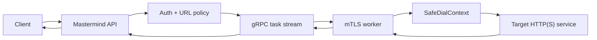

# edge-proxy-mesh - Public Technical Brief

Repository visibility: private
Implementation repository: `mamis-proxy`

This is a public-safe architecture note for `edge-proxy-mesh`, the portfolio
display name for the private `mamis-proxy` implementation. It describes the
system concept, protocol, and security model without exposing private source
code.

## One-Line Positioning

`edge-proxy-mesh` is a controlled Go-based distributed HTTP task proxy: workers
connect outbound to a public Mastermind service over mTLS, receive sanitized
HTTP tasks over gRPC bidirectional streams, execute requests with safe outbound
dialers, and stream responses back with per-task backpressure.

## Product Problem

Some data workflows need traffic to originate from controlled worker networks
without exposing worker machines to the public internet. A generic open proxy is
too broad for that job: it creates abuse surface, weak policy boundaries, and
hard-to-debug failure modes.

The system narrows the problem to controlled HTTP task execution:

- workers initiate outbound connections, so no inbound worker ports are needed;
- Mastermind owns authentication, policy, routing, and lifecycle;
- workers execute sanitized HTTP(S) requests rather than tunneling raw bytes;
- request and response bodies are streamed with explicit flow control;
- SSRF protection is enforced before dispatch and again at dial time.

## Architecture Diagram

## Data And Control Flow

1. A client sends an authenticated HTTP task request to the Mastermind service.
2. Mastermind extracts the target URL from the controlled API shape and applies
   method, scheme, port, host, and allowlist policy.
3. A worker is selected from the registered pool based on availability and
   policy metadata.
4. Mastermind sends `TaskStart` and request body chunks over a gRPC
   bidirectional stream.
5. The worker creates a new outbound HTTP request using a safe transport and a
   guarded dial context.
6. Response status, headers, body chunks, errors, and final task results are
   streamed back to Mastermind.
7. Chunk acknowledgements and task epochs keep retries, cancellations, and slow
   clients deterministic.

## Stack

- Go
- gRPC and Protocol Buffers
- mTLS worker identity
- BoltDB-style pending task storage design
- Safe outbound HTTP transport
- Structured audit logging
- Kubernetes/cloud deployment model as the intended operating environment

## Security And Reliability Notes

- V1 is not a generic browser proxy. It explicitly excludes `CONNECT`, raw TCP
  tunneling, WebSocket tunneling, raw TLS pass-through, and unauthenticated
  forward-proxy behavior.
- Mastermind blocks unsafe target input before a task is dispatched.
- Workers resolve hostnames and block private, loopback, link-local, multicast,
  documentation, and cloud metadata ranges at dial time.
- Worker registration is tied to client certificates, registry state,
  fingerprints, enabled flags, and revocation checks.
- The protocol uses task IDs, attempt epochs, leader epochs, sequence numbers,
  and chunk acknowledgements so partial failures can be observed and handled.

## Current State

The private repository includes the security-critical skeleton:

- command entrypoints for Mastermind and Worker;
- protobuf schema and generated Go bindings;
- client-facing proxy API validation;
- auth and user config loading;
- target URL normalization and policy tests;
- mTLS worker registry and revocation logic;
- gRPC registration service;
- safe worker dialer and HTTP transport;
- health handlers and config validation.

Some runtime pieces are intentionally MVP-stage:

- full task dispatch loop;
- response streaming from worker to client;
- durable pending-task reassignment;
- production observability integration.

## Roadmap

- Complete end-to-end worker dispatch and response streaming.
- Add persistent pending-task replay with body-replay constraints.
- Add worker health scoring, drain mode, and load-aware routing.
- Add metrics and audit dashboards for operations.
- Optional control-plane UI for worker registry, revocations, policy profiles,
  and task health. This is a roadmap surface, not a current production claim.

## Portfolio Relevance

`edge-proxy-mesh` demonstrates backend and data-infrastructure depth: Go
systems design, mTLS identity, gRPC streaming protocols, SSRF hardening,
backpressure, failure modeling, and distributed worker coordination.
