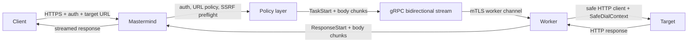

# mamis-proxy - Public Technical Brief

Repository visibility: private

This document is a public-safe architecture note for the private
`mamis-proxy` repository. The portfolio card names the concept as
`homemade-residential-proxy`; the implementation repository is `mamis-proxy`.

## One Line

`mamis-proxy` is a controlled distributed HTTP task proxy where worker machines
connect outbound to a public Mastermind server over mTLS, receive sanitized HTTP
tasks through gRPC bidirectional streams, execute target HTTP(S) requests with
safe outbound dialers, and stream responses back to the client.

## What It Is Not

The system is intentionally not a generic open proxy.

V1 explicitly excludes:

- `CONNECT`,
- browser-compatible full proxying,
- arbitrary TCP tunneling,
- WebSocket tunneling,
- raw client TLS pass-through,
- unauthenticated forward proxy behavior.

The core principle is that a worker creates a new outbound HTTP request to the
target. It does not blindly forward raw client bytes.

## Main Actors

| Actor | Responsibility |
| --- | --- |
| Client | Sends authenticated proxy task requests to Mastermind. |
| Mastermind | Public entrypoint, auth, policy, routing, task lifecycle. |
| Worker | Outbound-connected node that executes sanitized HTTP(S) tasks. |
| Target | Final HTTP(S) website or API reached by the worker. |
| Registry | Worker identity, certificate fingerprint, enabled state, tenancy tags. |

## Architecture

The design allows workers behind NAT or residential networks to participate
without exposing inbound ports. Workers initiate the secure connection to the
Mastermind server.

## Canonical Client API

V1 uses a controlled API shape:

- incoming path is a configured canonical path, commonly `/_proxy`,
- target URL is passed through a control header,
- incoming method becomes the target method,
- incoming body becomes the target body,
- proxy control headers are consumed by Mastermind and not forwarded.

Absolute-form compatibility can exist for custom clients, but it is not browser
proxy compatibility and does not enable `CONNECT`.

## Security Model

The system treats both sides as untrusted:

- client input is untrusted,
- target response is untrusted,
- worker transport is trusted only after mTLS and registry checks.

### Mastermind controls

- Client authentication.
- HTTP method allowlist per user.
- target URL extraction and normalization.
- allowed scheme and port checks.
- raw IP target blocking.
- per-user target allowlist.
- request header sanitization.
- deterministic error responses for invalid or blocked targets.

### Worker controls

- outbound HTTP client with no proxy chaining by default,
- TLS minimum version configured,
- no `InsecureSkipVerify`,
- redirect following disabled,
- `SafeDialContext` that resolves hostnames and blocks private, loopback,
  link-local, multicast, documentation, and cloud metadata ranges.

The two-layer SSRF model matters: Mastermind blocks obvious bad targets before
dispatch, and the worker blocks unsafe resolved IPs at dial time.

## Worker Identity and mTLS

Workers register through gRPC using a client certificate.

Registration validates:

- peer certificate presence,
- worker ID matching certificate identity,
- supported protocol version,
- certificate fingerprint against the worker registry,
- enabled worker flag,
- revocation list.

The registry stores:

- worker ID,
- enabled state,
- SHA-256 certificate fingerprint,
- tags,
- tenant IDs,
- max concurrency override.

Certificate comparisons normalize fingerprint formatting and use constant-time
comparison where relevant.

## gRPC Protocol Shape

The protobuf protocol separates control messages from streamed body data.

Core services:

- `ProxyService.Register`
- `ProxyService.StreamTasks`
- `ProxyService.RenewCert`
- `MastermindPeer.Heartbeat`
- `MastermindPeer.AnnouncePromotion`

Important messages:

- `RegisterRequest` / `RegisterResponse`
- `TaskStart`
- `BodyChunk`
- `ChunkAck`
- `ResponseStart`
- `TaskResult`
- `CancelTask`
- `LoadReport`
- `ConfigUpdate`

### Stream envelope design

Mastermind sends:

- task start,
- request body chunks,
- response chunk acknowledgements,
- cancellation,
- ping,
- drain instruction,
- config update.

Worker sends:

- response start,
- response body chunks,
- request chunk acknowledgements,
- final task result,
- load reports,
- pong.

## Backpressure and Chunking

The design avoids sending entire request or response bodies as one protobuf
message. Body data is chunked, and every chunk carries:

- task ID,
- attempt epoch,
- sequence number,
- end-of-body flag,
- total bytes observed.

`ChunkAck` enables per-task credit-based backpressure. This keeps one large
response from overwhelming the stream or starving other tasks.

## Attempt and Epoch Model

The protocol carries:

- `task_id`: globally unique task identity,
- `attempt_epoch`: increments on retry or reassignment,
- `leader_epoch`: protects against stale Mastermind leadership.

These fields make retry, cancellation, duplicate delivery, and HA fencing
observable and deterministic.

## Error Model

Errors are represented as a closed enum rather than arbitrary text.

Groups include:

- client cancellation/body errors,
- target DNS/connect/TLS/timeout/reset errors,
- policy URL/IP/scheme/port/method blocks,
- body size/deadline/QoS failures,
- worker shutdown/disconnect/no-worker states,
- stale epoch and protocol violations,
- internal failures.

This keeps client behavior and monitoring consistent across implementations.

## Current Implementation State

The private repo already includes the core skeleton and security-critical
building blocks:

- Go module and command entrypoints for Mastermind and Worker.
- protobuf schema and generated Go bindings.
- HTTP handler for client-facing proxy API validation.
- auth and user config loading.
- target URL normalization and policy tests.
- mTLS worker registry and revocation logic.
- gRPC registration service.
- safe worker dialer and HTTP transport.
- health handlers.
- config validation.

Some runtime pieces are still MVP-stage:

- full worker task dispatch,
- response streaming from worker to client,
- persistent pending task store,
- retry reassignment after partial failures,
- production observability integration.

## Why This Design Is Interesting

The project is less about "proxying" and more about building a secure distributed
task transport:

- workers can live behind NAT,
- Mastermind retains policy authority,
- raw tunneling is excluded,
- target I/O is bounded and auditable,
- protocol fields make retries and leadership explicit,
- SSRF defense exists both before dispatch and at the worker dial boundary.

## Roadmap

1. Complete task routing and worker selection.
2. Implement single-writer stream discipline for concurrent task sends.
3. Add persistent pending task metadata and idempotency index.
4. Implement request/response chunk credit accounting.
5. Add response-start retry boundary: retry only before response headers reach client.
6. Add structured metrics, audit logs, and trace IDs.
7. Harden worker drain and certificate renewal flows.

## Portfolio Relevance

This project demonstrates:

- Go backend systems design,
- gRPC bidirectional streaming,
- mTLS worker identity,
- SSRF-resistant outbound networking,
- distributed task lifecycle modeling,
- protocol design with backpressure and epochs,
- security-oriented scope control.
