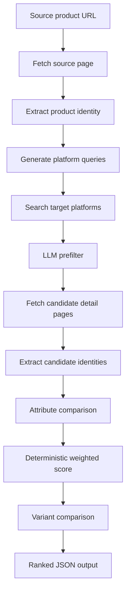

# product-matcher - Public Technical Brief

Repository visibility: private

This document is a public-safe architecture note for the private
`product-matcher` repository. It describes the product matching pipeline and
technical design without exposing private source code.

## One Line

`product-matcher` is a TypeScript pipeline and Claude Code skill that starts
from a source product URL, extracts a structured product identity, searches
competitor marketplaces, fetches candidate detail pages, and scores whether
each candidate is the same product, a variant, a partial match, or a mismatch.

## Product Problem

Marketplace product matching is not simple title similarity.

The same product can appear with:

- different titles,
- missing GTIN or MPN,
- platform-specific category names,
- Turkish character variants,
- selected color or size hidden in DOM state,
- search result titles that are shorter than detail page titles,
- price or seller noise,
- bot-protected pages,
- content match but variant mismatch.

The project models product identity as a structured object and separates content
match from variant match.

## Architecture

## Pipeline Stages

### 1. Source Product Understanding

The pipeline begins from a Trendyol URL and fetches page content and structured
metadata. It then asks an LLM to produce a normalized product identity.

The identity includes:

- title,
- brand,
- category and subcategory,
- product attributes,
- identifiers such as barcode, model number, SKU, MPN,
- source platform, URL, price, seller, stock state,
- selected variant,
- search hints.

### 2. Query Generation

The query stage produces platform-specific search queries. The important
constraint is that search terms should focus on brand and model/content identity,
not selected variant values like color or size. Variant values are used later
during scoring.

### 3. Search Execution

The browser adapter runs searches across configured platforms.

Configured targets include:

- Amazon TR,
- Hepsiburada,
- n11.

The adapter abstraction exists because marketplace pages differ heavily in bot
defense, DOM shape, and structured data quality.

### 4. Candidate Prefilter

All search results are flattened into a compact candidate list. An LLM classifies
each candidate as:

- `FETCH_DETAIL`,
- `UNCERTAIN`,
- `SKIP`.

The pipeline enforces hard limits after LLM prefiltering:

- max detail fetch count,
- max candidates per platform,
- total search cap,
- rate limit between browser actions.

This keeps cost and runtime bounded.

### 5. Candidate Detail Fetch

Candidates marked for fetch are opened through the browser adapter. Detail pages
are used because search result cards often miss attributes that matter for
matching, especially variant, model, material, size, or package quantity.

### 6. Candidate Identity Extraction

Each detail page is converted to the same normalized `ProductIdentity` shape as
the source product. Structured data is preferred when available, while HTML and
metadata are included as fallback evidence.

### 7. Attribute Comparison

The LLM compares source and candidate attributes using category-specific weights.
The output is a map of attribute comparisons:

- source value,
- candidate value,
- match type,
- numeric score,
- reasoning note.

### 8. Deterministic Scoring

After LLM comparison, the final score is deterministic.

The scorer:

- applies category weights,
- normalizes total score,
- caps the score when critical attributes fail,
- maps numeric score to match level,
- flags ambiguous cases for manual review.

Match levels:

- `exact_match`
- `high_confidence`
- `partial_match`
- `low_confidence`
- `no_match`

## Variant Matching

Variant matching is separated from content matching.

Supported variant types include:

- size,
- color,
- weight,
- volume,
- quantity,
- storage,
- dimension,
- flavor,
- scent,
- other.

Variant result states:

- `available`: exact variant match,
- `out_of_stock`: variant exists but is unavailable,
- `close_match`: nearby numeric variant,
- `unavailable`: content may match but variant differs,
- `unknown`: candidate page does not expose enough variant data.

The final combined score blends:

- content score,
- variant score,
- category-specific variant weight.

For example, footwear gives size and color a stronger role than generic title
similarity.

## Category Weight Model

The config defines different scoring weights per category.

Examples:

- personal care prioritizes brand and weight/volume,
- clothing prioritizes brand, size, and color,
- electronics prioritizes brand and model number,
- food prioritizes brand, quantity, flavor, and package size,
- home/living prioritizes dimension, material, color, and pack size.

This avoids using one generic similarity score across categories with different
identity rules.

## Browser Layer

The project defines browser adapter interfaces for:

- navigation,
- marketplace search,
- structured data extraction,
- screenshots where supported,
- backend selection.

Supported or planned backends include:

- Chrome Extension MCP,
- Playwright MCP,
- standalone Playwright,
- Chrome DevTools Protocol,
- Brave Search API.

The repository also contains notes for headed Playwright MCP operation because
some marketplace pages behave differently under headless automation.

## Output Contract

The pipeline emits a structured JSON object with:

- metadata:
  - timestamp,
  - skill version,
  - browser backend used,
  - searched platforms,
  - execution time,
  - candidate counts,
  - LLM call count,
  - token and cost estimate where available.
- source product identity,
- ranked matches,
- no-result platforms,
- recoverable errors,
- reasoning log.

Each match includes:

- rank,
- platform,
- URL,
- title,
- price,
- seller,
- stock state,
- content score,
- variant match,
- combined score,
- match level,
- manual review flag,
- attribute comparison,
- LLM reasoning.

## Failure and Recovery Model

The pipeline is designed to continue through recoverable failures:

- search failure on one platform does not stop other platforms,
- detail fetch failure skips that candidate,
- match extraction failure is recorded in the errors list,
- candidates without detail pages do not enter the final score,
- rate limits and platform caps bound worst-case execution.

## Current Engineering Strengths

- Strong typed domain model.
- Split between browser layer, LLM layer, matching layer, and config layer.
- Category-aware scoring instead of generic fuzzy matching.
- Explicit variant logic.
- Cost and token accounting hooks.
- Claude Code skill integration.
- JSON output suitable for downstream automation.

## Known Product Constraints

- Marketplace DOM selectors change frequently.
- Bot protection varies by platform and session state.
- Search results can be incomplete or misleading.
- LLM extraction must be validated with deterministic caps and review flags.
- Selected variants may require browser interaction, not just static HTML.

## Roadmap

1. Build a labeled ground-truth evaluation set.
2. Measure precision/recall by category and platform.
3. Add platform-specific extraction confidence scoring.
4. Persist run artifacts for audit and regression testing.
5. Add a UI for manual review and correction.
6. Support batch source URLs and queue-based execution.
7. Add stable provider abstraction for non-Claude LLM execution.

## Portfolio Relevance

This project demonstrates:

- applied AI pipeline design,
- entity resolution,
- browser automation under real marketplace constraints,
- typed TypeScript architecture,
- deterministic scoring around probabilistic extraction,
- category-specific matching semantics,
- MCP/Claude Code workflow integration.
