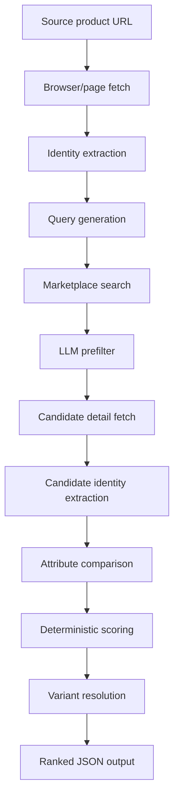

# commerce-match-engine - Public Technical Brief

Repository visibility: private
Implementation repository: `product-matcher`

This is a public-safe architecture note for `commerce-match-engine`, the
portfolio display name for the private `product-matcher` implementation. It
explains the product matching pipeline without exposing private source code.

## One-Line Positioning

`commerce-match-engine` is a TypeScript product-intelligence pipeline that
starts from a source marketplace URL, extracts a normalized product identity,
orchestrates browser-backed competitor search, and scores whether candidates are
the same product, a variant, a partial match, or a mismatch.

## Product Problem

E-commerce product matching is not title similarity. The same SKU can appear
with missing identifiers, different language, platform-specific categories,
variant state hidden in the page, short search-result titles, seller noise, or
bot-protected detail pages.

The project treats product matching as entity resolution:

- extract a structured identity from the source product;
- generate search queries that separate product identity from variant choice;
- use browser automation when marketplace pages require it;
- prefilter candidates before expensive detail fetches;
- compare attributes with category-specific weighting;
- produce scored output that separates content match from variant availability.

## Architecture Diagram

## Data And Control Flow

1. The pipeline receives a source product URL, initially focused on Trendyol.
2. Browser adapters fetch page content, structured metadata, and fallback DOM
   evidence.
3. An LLM normalizes product identity: brand, title, category, identifiers,
   model, attributes, selected variant, price, seller, stock, and search hints.
4. Platform-specific queries are generated without overfitting to selected
   variant values such as color or size.
5. Search results are flattened and passed through a compact LLM prefilter.
6. Only promising candidates are opened as detail pages.
7. Candidate identities are normalized into the same shape as the source.
8. Attribute comparisons and deterministic scoring produce confidence tiers and
   review flags.

## Stack

- TypeScript
- Playwright and browser automation adapters
- Chrome Extension MCP and Playwright MCP integration points
- Claude Code skill packaging
- LLM-orchestrated extraction, filtering, and comparison
- JSON-first output contracts for downstream automation

## Security And Reliability Notes

- Browser backends are abstracted because marketplace behavior differs by
  platform, headless mode, session state, and bot defense.
- LLM output is used for interpretation, while final scoring is deterministic
  and category-weighted.
- Hard limits bound detail fetch count, per-platform candidate count, total
  search size, and browser action rate.
- Variant matching is separated from content matching so "same product,
  unavailable size/color" does not become a false exact match.
- The system is a matching pipeline, not a checkout bot, account automation
  system, or generic marketplace scraper.

## Current State

The private repository includes:

- source identity extraction;
- query generation;
- marketplace search orchestration;
- LLM candidate prefiltering;
- candidate detail extraction;
- category-aware attribute comparison;
- deterministic scoring and match tiers;
- browser backend abstractions;
- Claude Code skill workflow notes.

## Roadmap

- Expand target marketplace adapters.
- Add stronger GTIN/MPN fallback logic and conflict handling.
- Add review UI for low-confidence or high-value matches.
- Add batch mode for catalog-scale matching jobs.
- Add a control-plane surface for match queues, evidence review, and export
  health. This is a roadmap surface rather than a current production claim.

## Portfolio Relevance

`commerce-match-engine` demonstrates TypeScript data tooling, browser
orchestration, MCP-first AI workflow design, entity resolution, deterministic
scoring after LLM interpretation, and practical product-intelligence pipeline
design.
